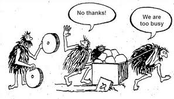

Projects have deadlines. Classes have deadlines. That research paper is due on Friday, and your homework is due in two days. In school, everything can be such a rush sometimes. There's a lot of assignments from every class which can hinder the thought process and planning that goes into architecting beautiful systems. Of course no one is going to be building the most robust temperature converting application for their Intro to CS class or doing crazy math derivations for the Calculus II midterm, but the fact of the matter is that sometimes we need some direction to complete our task and move quickly.

In most tasks in the programming world, we are given a set of instructions or requirements that are needed. This makes it simpler to single out problems and get to the solution quicker. As long as the program is not meeting specifications, more work needs to be done to meet them. However, without those specifications programmers may lose sight of what needs to be accomplished.

There is a definite reason why we have directions for most of the things in our life. If I were to go to IKEA right now (granted there is no IKEA in Hawaii) and pick up a new cabinet, I wouldn't start trying to guess at how to build the optimal cabinet. The instructions for an optimal cabinet is already in the box. Same with programming. Through the countless hours and efforts of programmers in places like Facebook and Airbnb, they've created a guide for well-written programming. This guide for javascript programming is called ESLint. Linting software is particularly useful in Javascript, but is extendable to all languages of programming.

Linting is important in making sure that programmers don't lose sight of what needs to be accomplished. They don't need to worry about styling their code a specific way since there is the linting program that provides quick feedback on the state of current code. At the same time, it enables programmers to move quickly towards accomplishing their tasks and provides a framework for everyone to follow.
