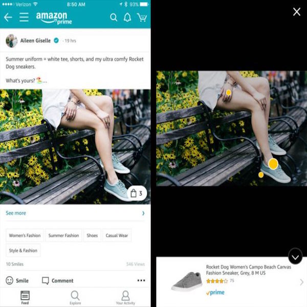

  
  

Amazon Spark is a place to discover things from people who share your interests. Whether you’re looking for inspiration for home décor or seeking advice for the best long-distance running shoes, Spark makes it easy to discover—and shop—stories and ideas from a community that likes what you like.

For this project, I worked on enhancing the publishing experience of the application. I had to program in both Java and React Native to implement new features on the application. We worked in an agile environment and accomplished tasks efficiently.

You can learn more at the [Amazon Spark](https://www.amazon.com/spark/).
